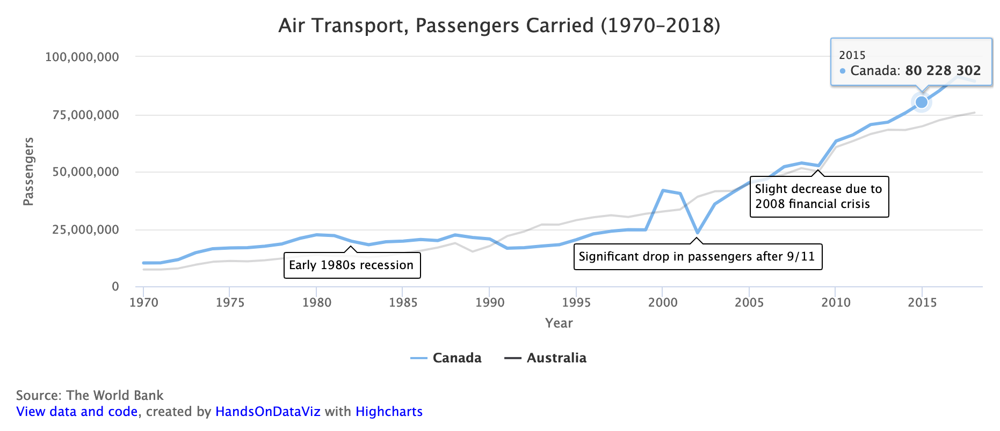

# Annotated Line Chart with Highcharts



## Demo
https://handsondataviz.github.io/highcharts-line-annotated/

Sample data from the World Bank, https://databank.worldbank.org/source/world-development-indicators

## Create your own 
See chapter 10: Chartjs and Highcharts templates in [Hands-On Data Visualization](https://handsondataviz.org) by Jack Dougherty and Ilya Ilyankou.

In `data.csv`, each row is a point in time (x-axis). First column are x-axis values,
second and all other columns except the last one column are y-axis values.
The final column contains annotations.
You can use HTML tags inside an annotation (such as `<br>` to break for a new line,
or `<b>bold text</b>` for bold text).

In `script.js`, you can customize the values of variables shown in the code snippet below. For more customization, see [Highcharts API reference](https://api.highcharts.com/highcharts/).

```javascript
var TITLE = 'Air Transport, Passengers Carried (1970–2018)';

// Caption underneath the chart
var CAPTION = 'Source: The World Bank';

// x-axis label and label in tooltip
var X_AXIS = 'Year';

// y-axis label and label in tooltip
var Y_AXIS = 'Passengers';

// Should y-axis start from 0? `true` or `false`
var BEGIN_AT_ZERO = true;

// `true` to show the legend, `false` to hide
var SHOW_LEGEND = true;
```

## Why am I not seeing my chart when I open `index.html` in the browser?
This error is known as cross-origin request error. When you double-click the file to open locally in your browser, you will see the URL in the address bar starting with `file:`, and all attempts to read a local CSV file, even though it is located in the same folder, will fail.

Here are a few ideas how to go around it:
* Find out how to disable same-origin policy in your browser (to start with, see [this blog post](https://alfilatov.com/posts/run-chrome-without-cors/) or [this StackOverflow thread](https://stackoverflow.com/questions/3102819/disable-same-origin-policy-in-chrome)).
* Install a program that will emulate a local server on your device, such as `live-server`(https://www.npmjs.com/package/live-server).
* Move your CSV files to a remote location on the web (such as GitHub Gist, AWS S3, or a Wordpress site),
and in `script.js`, change `$.get('./data.csv', function(csvString) {` to `$.get('https://wherever.your/file/is/data.csv', function(csvString) {`.
* Do all the development (file modifications) within GitHub without downloading this repository, using either GitHub's web interface, or GitHub Desktop application.

## See other chart templates
* Chart.js Bar Chart: https://github.com/HandsOnDataViz/chartjs-bar
* Chart.js Bar Chart with Error Bars: https://github.com/HandsOnDataViz/chartjs-error-bars
* Chart.js Line Chart: https://github.com/HandsOnDataViz/chartjs-line
* Chart.js Scatter Chart: https://github.com/HandsOnDataViz/chartjs-scatter
* Chart.js Bubble Chart: https://github.com/HandsOnDataViz/chartjs-bubble
